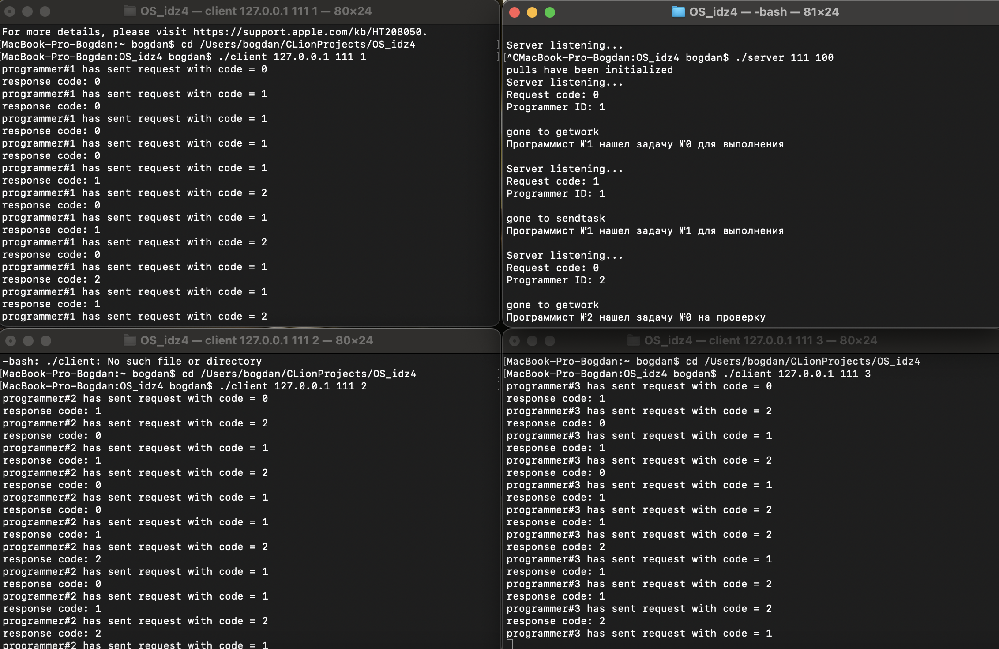
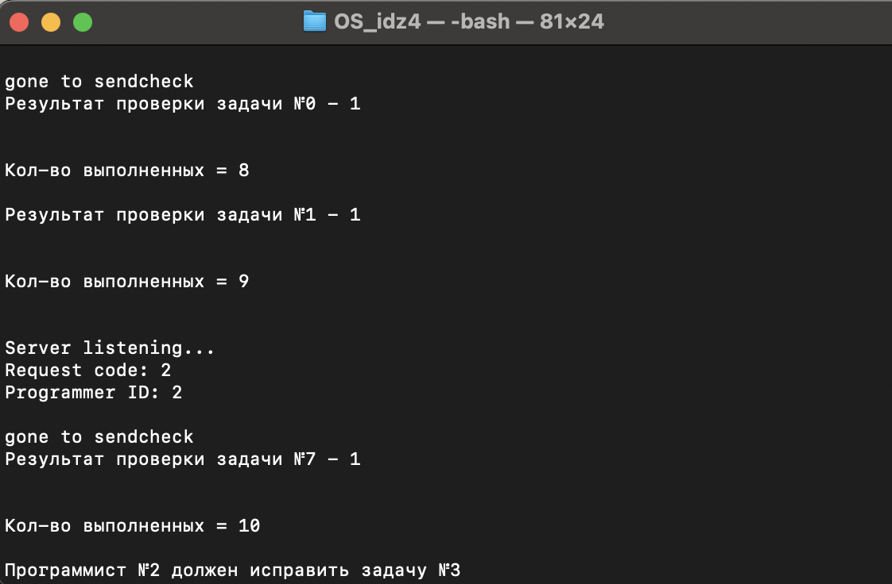
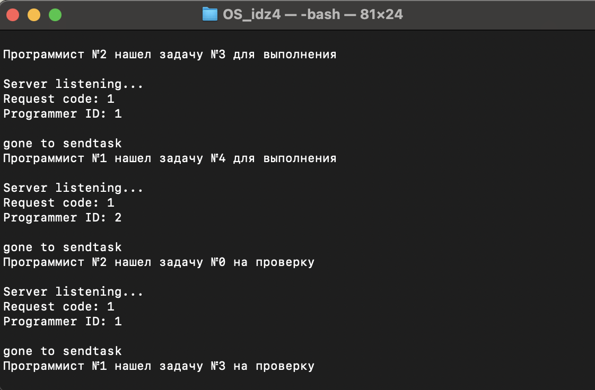
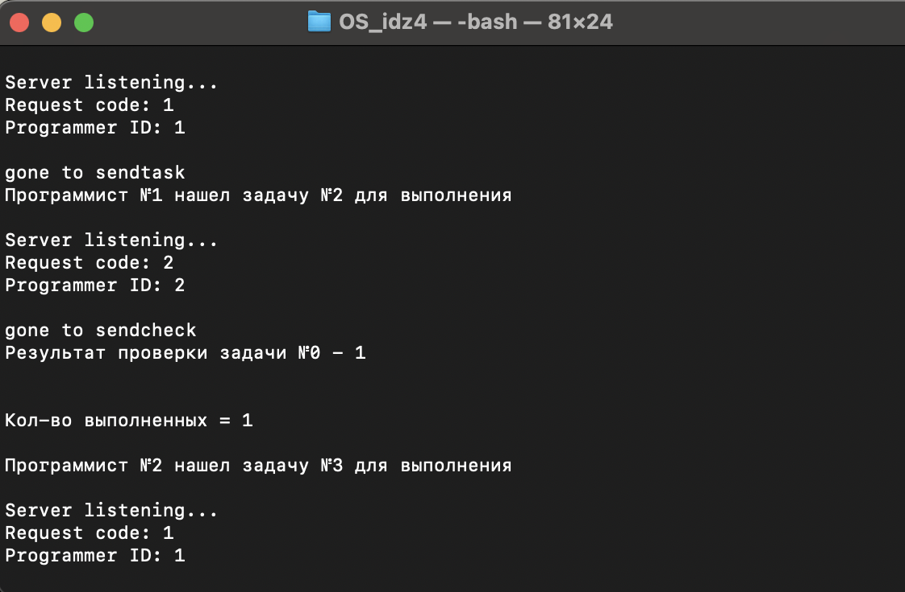

# Пронин Богдан БПИ-214 группа ИДЗ-4
---
## Вариант 21
## Условие задачи
**Задача о программистах.** В отделе работают три программиста. Каждый программист пишет свою программу и отдает ее на проверку другому случайному программисту. Программист переключается на проверку чужой программы, когда его собственная уже написана и передана на проверку. По завершении проверки, программист возвращает программу с результатом (формируемым случайно по любому из выбранных Вами законов): программа написана правильно или неправильно. Программист спит, если отправил свою программу и не проверяет чужую программу. Программист просыпается, когда получает заключение от другого программиста. Если программа признана правильной, программист пишет другую программу, если программа признана неправильной, программист исправляет ее и отправляет на проверку тому же программисту, который ее проверял. К исправлению своей программы он приступает, завершив проверку чужой программы. Проверки и коррекции одной программы могут проходить многократно (правильность программы задается случайным образом). При наличии в очереди проверяемых программ и приходе заключения о неправильной своей программы программист может выбирать любую из возможных работ. Создать приложение, моделирующее работу программистов. Каждый программист задается отдельным процессом.
## Решение
1. Структура клиент-серверного приложения:
- Сервер: отвечает за передачу данных между клиентами и контролирует процесс проверки программ. Он будет принимать программы от одного программиста и передавать их другому программисту для проверки. Сервер также будет получать результаты проверки и возвращать их отправителю.
- Клиенты: каждый клиент представляет собой отдельного программиста. Каждый клиент будет отправлять свою программу на проверку и получать программу для проверки от других программистов. Клиенты также будут получать результаты проверки и принимать решение о дальнейших действиях в зависимости от результата.

2. Взаимодействие между клиентами и сервером:

- Клиенты могут отправлять программы на проверку серверу с помощью запросов. Они будут передавать свою программу и информацию о том, кому адресована программа.
- Сервер будет принимать запросы от клиентов, получать программу для проверки и информацию о том, кому отправить результат проверки.
- Сервер будет передавать программы для проверки другим клиентам и ждать от них результатов проверки.
- После получения результатов проверки сервер будет отправлять результаты обратно отправителям программ.

3. Сценарий работы приложения:

- Каждый клиент и сервер запускаются и ожидают подключений и запросов.
- Клиенты могут отправлять программы на проверку серверу.
- Сервер принимает программу от клиента, выбирает другого случайного клиента для проверки и отправляет программу ему.
- Клиент, получив программу, проводит проверку и формирует результат (правильно или неправильно).
- Клиент отправляет результат проверки серверу.
- Сервер получает результат проверки и отправляет его обратно клиенту, который отправил программу.
- Клиент, получив результат проверки, принимает решение о дальнейших действиях: написание новой программы или исправление предыдущей.
- Процесс повторяется до тех пор, пока все программисты не завершат свою работу.
### Решение на 4-5 баллов (папка 4_5_points)
Программа будет прослушивает указанный порт и может принимать до трех клиентских подключений одновременно

